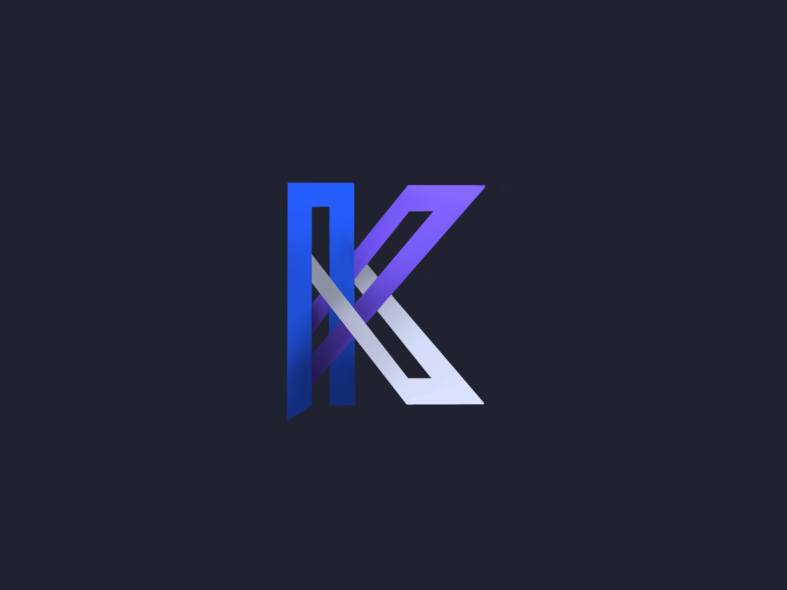

# KONSENSUS

Konsensus is a company founded in the Blockchain industry.

Intellectual property theft happens to 1 in 5 companies and costs the American economy between $225 and $600 billion annually. Our proposed solution is a decentralized file hosting service. Using smart contract technology, access and ownership of files can be easily tracked and saved on the blockchain. With this service, we are targeting innovation-based SMEs that often do not have protocols in place to protect against IP theft, nor do they have the funds to defend a lawsuit. Having a secure, decentralized file sharing system, start-ups can be assured their confidential documents are kept safe and suspicious actions are monitored. 

Table of Contents
---

- [People](./team/)
- [Diversity](./team/diversity.md)
- [Product & Research](./product_research/)
    - [Market](./product_research/market.md)
    - [Roadmap](./product_research/roadmap.md)
