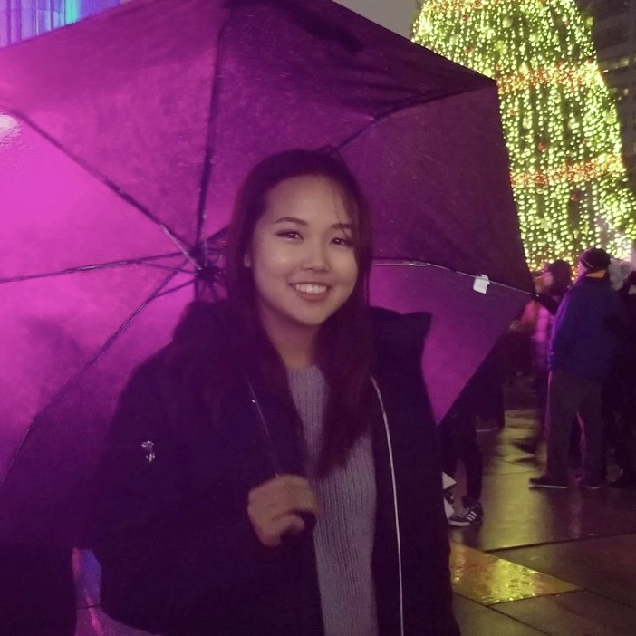

# Stella Cai

- Software Developer
- s.cai@mail.utoronto.ca

## Links

- [GitHub](https://github.com/stella-cai)
- [LinkedIn](https://www.linkedin.com/in/stella-cai/)

## About Stella

Stella (aka Sijia) currently studies computer science, statistics, and economics at the University of Toronto. Originally from the US, she has experience as a fullstack software engineer and specializes in mobile and front-end development. Stella has lived in several cities growing up, including Beijing, Montreal, and Boston. She enjoys spending her free time discovering new recipes, online shopping, and taking care of her pet hamster.

## Strengths

- Knowledgeable in front-end development and design, particularly for mobile interfaces.
- Skilled in technical and academic writing.
- Experienced in working in fast-paced engineering teams.

## Weaknesses

- Can lose sight of the bigger picture by focusing too much on the little things.
- Sometimes indecisive and second-guesses her choices.
- Unpredictable sleep schedule.